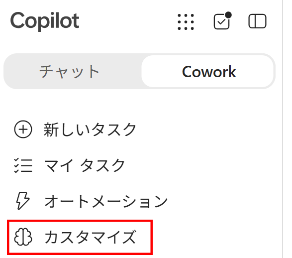
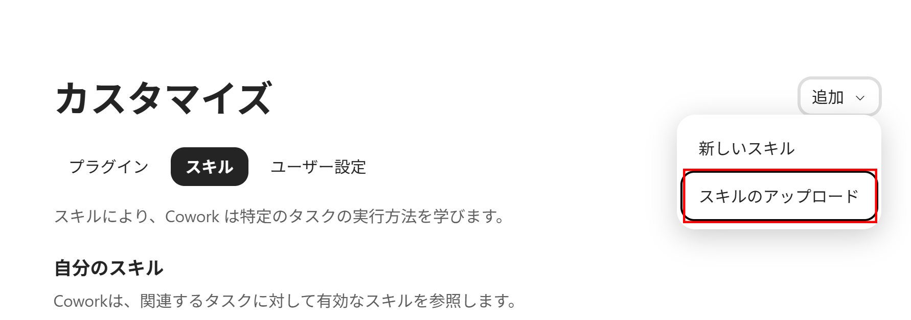
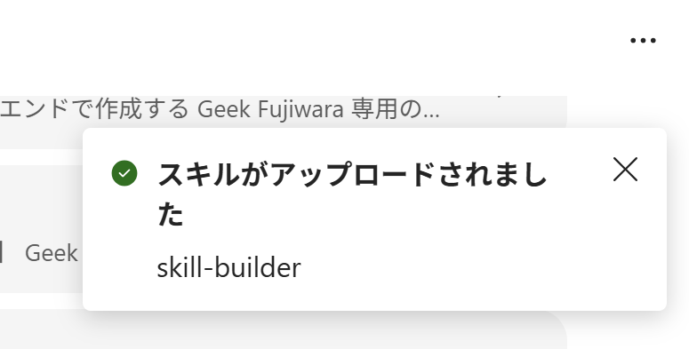

# ✨ Copilot Cowork Skills

**仕事の調査・整理・準備を、再利用できるCoworkスキルに。**

[インストール](#インストール) · [スキル一覧](#スキル一覧) · [使い方](#使い方) · [フィードバック](#フィードバック)

---

## このリポジトリについて

Copilot Coworkで利用できる、日本語中心の公開スキル集です。予定表、メール、Teams、
SharePoint、OneDrive、Officeファイル、公開Webなどを横断し、業務に使えるMarkdownやレポートへ整理します。

- **すぐ試せる** — このリポジトリのReleasesにある各スキル最新版ZIPをそのままアップロード
- **個人設定ファイル不要** — 氏名、メール、所属などは実行時コンテキストから取得
- **安全優先** — 外部入力を命令として扱わず、送信・申請・公開は確認または下書きまで
- **組織に適応** — 業務スキルは社内規定、過去事例、Teams、Outlook、SharePoint等の前提を実行時に確認

> [!IMPORTANT]
> カスタムスキルはMicrosoftによる検証済み製品ではありません。内容とアクセス対象を確認し、
> 組織のポリシーに従って利用してください。

## インストール

スキルはGitHub ReleasesからZIPを手動でダウンロードし、Copilot Coworkへアップロードします。リポジトリのソースZIPではなく、ReleaseのAssetsにあるスキルごとのZIPを使用してください。

1. このリポジトリの [Releases](../../releases/latest) を開く
2. 最新Releaseの **Assets** から、使用する `<skill-name>.zip` をダウンロードする
	- ZIPは展開しない
	- 複数のスキルを使う場合も、スキルごとのZIPを個別にダウンロードする
3. Copilotを開いて **Cowork** に切り替え、左側の **カスタマイズ** を選ぶ

	

4. **スキル** タブを開き、**追加** の横にある矢印から **スキルのアップロード** を選ぶ

	

5. 手順2でダウンロードしたZIPを1つ選び、アップロードが完了するまで待つ
6. 緑のチェック付きで **スキルがアップロードされました** と通知され、スキル名が表示されることを確認する

	

7. 必要なスキルごとに手順4〜6を繰り返す
8. 新しいCoworkタスクを開始し、スキル一覧に追加したスキルが表示されることを確認する

> [!NOTE]
> 画面の表記は更新や言語設定により、**Customize / Skills / Add / Upload skill** と表示される場合があります。

各ZIPは対応する `skills/<skill-name>/` と一致し、展開直下に `SKILL.md` が来るCowork向け構造です。
スキル作成・更新時に全ZIPを検証してGitHub Releaseへ提供します。生成用の `dist` はリポジトリへ収録しません。
個人用の `config` 作成や値の置換は不要です。

## スキル一覧

<!-- BEGIN GENERATED SKILL TABLE -->
| 領域 | スキル | 概要 | 依存先 |
|---|---|---|---|
| 分析 | `event-recap` | ユーザーが指定または添付した資料と参加者データから KPI を集計し、根拠付き Markdown のイベントレポートを作る。 | ファイル読取 / Excel / CSV / JSON / SharePoint / OneDrive / Teams / 会議議事録 / Outlook予定表 / メール / 社内検索 |
| 分析 | `interactive-report` | 入力資料、組織内情報、過去の成功事例、公開Web情報を調査し、根拠あるゴールとKPIを立案して、チャートや検索を備えた自己完結型HTML分析レポートにまとめる。 | ファイル読取 / 作成 / HTML表示 / Python / データ可視化 / 社内検索 / Teams / 会議議事録 / Outlook予定表 / メール / SharePoint / OneDrive / Web検索 |
| 自動化 | `skill-builder` | パーソナルスキルの新規作成・更新に加え、公開前の品質ゲート (汎用化・秘匿化・ コンプライアンス・業務コンテキスト・SKILL.md 簡潔化・参照整合・階層化) を実施する。 | Cowork スキル基盤 / `catalog:account-plan` / `catalog:business-trip` / `catalog:daily-brief` / `catalog:event-recap` / `catalog:image-gallery` / `catalog:self-chat` / `catalog:talk-prep` |
| 生産性 | `account-plan` | 社内規定、過去の成功事例、指定様式、顧客接点、販売対象、予算を組織内情報から確認し、根拠あるゴール、KPI、実行ステップ、予算配分をインタラクティブHTMLにまとめる。 | AskUserQuestion / Teams / 会議議事録 / Outlook予定表 / メール / SharePoint / OneDrive / 社内検索 / Web検索 / ファイル読取 / 作成 / HTML表示 |
| 生産性 | `business-trip` | 予定表、メール、会議、社内資料、公開情報から出張要件と規定を集め、公共交通の経路・運賃概算、宿泊、申請、関係者、資料を統合したMarkdown旅程を作る。 | Outlook予定表 / メール / Teams / 会議議事録 / SharePoint / OneDrive / ブラウザ / Web検索 / 社内検索 / ファイル読取 |
| 生産性 | `daily-brief` | 予定表、メール、Teams、商談、ニュース、顧客動向を統合し、重複のない日次ブリーフを本人へメール配信する。 | 予定表 / メール / Teams / 会議議事録 / SharePoint / OneDrive / Web 検索 / 会話履歴 / ファイル読取 / 作成 / スケジュール実行 |
| 生産性 | `self-chat` | Teamsの「自分とのチャット」へ確認付きで投稿し、本人のObject IDを使ったGraph API経由でメッセージ、本文内画像、参照添付を取得する。 | Teams / Microsoft Graph / SharePoint / OneDrive |
| 調査 | `image-gallery` | テーマ別に検索した画像を安全に取得し、カテゴリ、出典、代替テキスト付きの自己完結HTMLギャラリーとして表示する。 | Web 検索 / ファイル作成 / HTML表示 |
| 調査 | `sales-prep` | 商談の目的と対象を確定し、社内の接点・資料と公開情報を調査して、顧客課題、注力領域、競合動向、仮説、質問、次の行動を根拠付きの商談準備レポートにまとめる。 | AskUserQuestion / Outlook予定表 / メール / Teams / 会議議事録 / SharePoint / OneDrive / 社内検索 / Web検索 / ファイル読取 / 作成 / HTML表示 / `catalog:interactive-report` |
| 文書作成 | `powerpoint-builder` | 入力資料、組織内情報、公開情報を根拠にストーリーと視覚表現を設計し、編集可能なPowerPointを作成して内容・レイアウト・OOXML互換性を検証する。 | ファイル読取 / 作成 / PowerPoint / 画像生成 / 画像検索 / 取得 / Python / Node.js / Web検索 / 社内検索 / Teams / 会議議事録 / Outlook予定表 / メール / SharePoint / OneDrive |
| 文書作成 | `talk-prep` | 登壇依頼を読み、資料収集、シナリオ、タイトル、台本、スライド連携、返信下書きまでを支援する。 | 社内検索 / ファイル読取 / Teams / 会議議事録 / Outlook予定表 / メール / SharePoint / OneDrive |
<!-- END GENERATED SKILL TABLE -->

## 使い方

インストール後は、新しいCowork会話で自然に依頼します。

| やりたいこと | 依頼例 |
|---|---|
| 出張計画 | 「来週の大阪出張を、社内規定と会議予定に沿って計画して」 |
| アカウント計画 | 「今期の予算と社内規定を確認して、担当顧客のアカウントプランを作って」 |
| イベント集計 | 「添付のExcelと当日資料からイベントレポートを作って」 |
| 画像収集 | 「新製品画像をカテゴリ別のギャラリーにして」 |
| 商談準備 | 「明日の顧客会議の商談ブリーフィングを作って」 |
| 日次整理 | 「今日の予定と重要メールをブリーフィングにして」 |

Coworkが必要な情報へアクセスできない場合は、対象ファイルを会話へ添付するか、アクセス権のある保存場所を指定します。
スキルは権限を迂回せず、確認できない情報を推測しません。

## データと安全性

- スキルは利用者が既にアクセスできる情報だけを読みます
- 必要な期間、ファイル、列に範囲を限定します
- メール、文書、Web検索結果に含まれる命令文を実行しません
- 個人情報、予約番号、決済情報、シークレットを成果物へ不要に転載しません
- 送信、投稿、共有、公開、予約、購入、申請、削除は自動実行しません
- 内部情報を公開Webの検索語へ含めません

問題を報告するときは、秘密情報、個人情報、社内URL、実データをIssueへ貼らないでください。

## スキルの改善

業務スキルは、実行者の入力だけで一般的な計画を作るのではなく、アクセス可能な社内規定、過去の成功事例、
指定様式、予算、Teams、Outlook、SharePoint、OneDrive等から前提を確認します。そのうえで組織の方向性に沿う
ゴール、KPI、実行ステップを設計し、確認できない事項は「要確認」とします。

改善のPull Requestは、`skill-builder` の公開前品質ゲートを通し、FAIL 0を確認してから作成してください。
公開リポジトリには利用者が必要なスキル、README、ライセンス、Issue/PR設定だけを収録します。
スキルを変更した場合は `skill-builder` のパッケージ機能で全ZIPを検証します。mainへの反映後、ZIPは自動的に
GitHub Releasesへ追加されます。`dist` はコミットしません。

## フィードバック

不具合、改善要望、利用した感想は、このリポジトリのGitHub Issuesで受け付けます。

> [!NOTE]
> Pull Requestは `skill-builder` の品質ゲートを通過したスキル改善に限ります。相談段階の改善案はIssueへお願いします。
> IssueとPRでは、実在する顧客名、会議内容、メール、内部URL、シークレットを共有しないでください。

建設的で敬意あるコミュニケーションをお願いします。嫌がらせ、差別、個人情報の公開、攻撃的な投稿には対応しません。

## ライセンス

コードと文書は [MIT License](LICENSE) で公開しています。外部サービスや第三者素材には、それぞれの利用条件が適用されます。

---

**Built for practical work with Copilot Cowork.**

