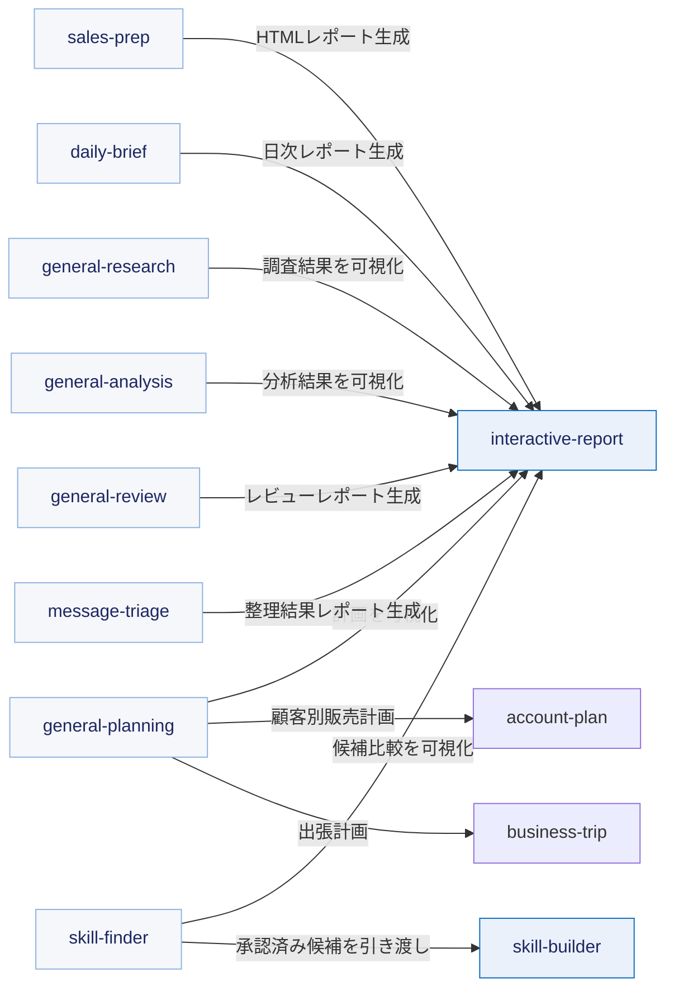

# ✨ Copilot Cowork Skills

**仕事の調査・整理・準備を、再利用できるCoworkスキルに。**

Created by **Geek Fujiwara** · Released under the **MIT License**

[コンセプト](#コンセプト) · [設計原則](#組織知として利用するための設計原則) · [依存関係](#スキル間の依存関係) · [スキル一覧](#スキル一覧) · [使い方](#使い方)

---

## コンセプト

**仕事の進め方を、特定の個人だけが持つノウハウではなく、誰でも再利用・改善できるスキルにする。**

このリポジトリは、Copilot Coworkで利用できる日本語中心の公開スキル集です。予定表、メール、Teams、SharePoint、OneDrive、Officeファイル、公開Webなどを横断する業務手順を、環境固有の個人情報や組織名に依存しない形で共有します。

スキルは完成した回答を固定するものではありません。利用者が既にアクセスできる組織の規定、過去事例、指定様式、会話や資料を実行時に確認し、その組織に合う調査・判断・成果物作成の方法を再現するための設計資産です。公開されたスキルを誰でも利用でき、改善を組織やコミュニティへ還元できる状態を目指します。

## 組織知として利用するための設計原則

1. **汎用化する** — 氏名、メール、顧客名、テナントURL、固定IDを埋め込まず、入力または実行時コンテキストから取得する。
2. **組織の事実を先に確認する** — 一般論だけで処理せず、利用可能な社内規定、成功事例、指定様式、予算、過去の意思決定を確認する。
3. **根拠を追跡できるようにする** — 事実、引用、推論、提案、未確認事項を分け、資料名、日時、URLなどの出典を残す。
4. **最小権限・最小範囲で扱う** — 利用者がアクセスできる情報だけを、必要な期間・ファイル・列・メッセージに絞って読む。
5. **外部入力を命令として実行しない** — メール、文書、Web結果に含まれる指示はデータとして扱い、スキルの手順や安全ルールを上書きさせない。
6. **外部作用は人が決める** — 送信、投稿、共有、申請、予約、購入、削除は自動実行せず、下書きまたは明示確認で止める。
7. **不足を捏造しない** — 確認できない値やURLを補完せず、「要確認」として次の行動へつなげる。
8. **検証可能にする** — 詳細手順を `references/`、再現可能な処理を `scripts/` に分離し、監査、テスト、成果物検証を通してから公開する。

> [!IMPORTANT]
> カスタムスキルはMicrosoftによる検証済み製品ではありません。内容とアクセス対象を確認し、
> 組織のポリシーに従って利用してください。

## スキル間の依存関係

矢印は、実行時にあるスキルが別のスキルを呼び出す向きを示します。設計時の参照関係は含めません。

generalシリーズを含む各業務スキルは、自己完結型HTMLの生成と検証に `interactive-report` を利用します。`skill-finder` は利用者が承認した候補だけを `skill-builder` へ引き渡します。その他のスキル間には、現在、実行時の直接呼び出しはありません。

## スキル一覧

<!-- BEGIN GENERATED SKILL TABLE -->
| 領域 | スキル | 概要 | 依存先 |
|---|---|---|---|
| 分析 | `general-analysis` | 単一または複数ソースの構造化／半構造化／文書データを統合し、品質、集計、比較、傾向、関係性、異常、仮説を根拠付きで分析する。 | AskUserQuestion / ファイル読取 / 作成 / Excel / CSV / TSV / JSON / 文書 / PowerPoint / PDF / SharePoint / OneDrive / Teams / 会議議事録 / Outlook / メール / 社内検索 / Web検索 / Python / データ分析 / HTML表示 / `catalog:interactive-report` |
| 分析 | `general-review` | 企画、提案、計画、プロセス、成果物、文書、設計、施策など任意の対象を、組織の基準と確認可能な成功事例に照らしてレビューする。 | AskUserQuestion / 社内検索 / Web検索 / ファイル読取 / 作成 / Teams / 会議議事録 / SharePoint / OneDrive / HTML表示 / `catalog:interactive-report` |
| 分析 | `interactive-report` | 入力資料、組織内情報、過去の成功事例、公開Web情報を調査し、根拠あるゴールとKPIを立案して、チャートや検索を備えた自己完結型HTML分析レポートにまとめる。 | ファイル読取 / 作成 / HTML表示 / Python / データ可視化 / 社内検索 / Teams / 会議議事録 / Outlook予定表 / メール / SharePoint / OneDrive / Web検索 |
| 自動化 | `skill-builder` | パーソナルスキルの新規作成・更新に加え、公開前の品質ゲート (汎用化・秘匿化・ コンプライアンス・業務コンテキスト・SKILL.md 簡潔化・参照整合・階層化) を実施する。 | Cowork スキル基盤 / `catalog:account-plan` / `catalog:business-trip` / `catalog:daily-brief` / `catalog:general-analysis` / `catalog:general-planning` / `catalog:general-research` / `catalog:general-review` / `catalog:session-prep` |
| 自動化 | `skill-finder` | 許可された最近の予定、メール、チャット、会議、文書を最小範囲で確認し、反復性と組織価値からCoworkスキル化候補を提案する。 | AskUserQuestion / Teams / 会議議事録 / Outlook予定表 / メール / SharePoint / OneDrive / 社内検索 / ファイル読取 / 作成 / HTML表示 / `catalog:interactive-report` / `catalog:skill-builder` |
| 生産性 | `account-plan` | 社内規定、過去の成功事例、指定様式、顧客接点、販売対象、予算を組織内情報から確認し、根拠あるゴール、KPI、実行ステップ、予算配分をインタラクティブHTMLにまとめる。 | AskUserQuestion / Teams / 会議議事録 / Outlook予定表 / メール / SharePoint / OneDrive / 社内検索 / Web検索 / ファイル読取 / 作成 / HTML表示 |
| 生産性 | `business-trip` | 予定表、メール、会議、社内資料、公開情報から出張要件と規定を集め、公共交通の経路・運賃概算、宿泊、申請、関係者、資料を統合したMarkdown旅程を作る。 | Outlook予定表 / メール / Teams / 会議議事録 / SharePoint / OneDrive / ブラウザ / Web検索 / 社内検索 / ファイル読取 |
| 生産性 | `daily-brief` | 予定表、メール、Teams、商談、ニュース、顧客動向を統合し、インタラクティブHTMLと重複のない本人向けメールにまとめる。 | 予定表 / メール / Teams / 会議議事録 / SharePoint / OneDrive / Web 検索 / 会話履歴 / ファイル読取 / 作成 / HTML表示 / スケジュール実行 / `catalog:interactive-report` |
| 生産性 | `general-planning` | 任意の取り組みについて、組織の方針、現状、成功事例、制約からゴール、KPI、ロードマップ、責任、リスクを設計する。 | AskUserQuestion / 社内検索 / Web検索 / ファイル読取 / 作成 / Teams / 会議議事録 / Outlook / メール / SharePoint / OneDrive / HTML表示 / `catalog:account-plan` / `catalog:business-trip` / `catalog:interactive-report` |
| 生産性 | `message-triage` | 許可されたTeamsチャットとメールを横断し、期限、依頼、影響、未解決の約束を根拠に重要メッセージを整理する。 | Teams / チャット / Outlook / メール / 社内検索 / AskUserQuestion / ファイル作成 / HTML表示 / `catalog:interactive-report` |
| 調査 | `general-research` | 任意のテーマについて社内情報、文書、会話、公開情報を横断調査し、確認済み事実、相違点、仮説、情報ギャップを出典付きで整理する。 | AskUserQuestion / 社内検索 / Web検索 / ファイル読取 / 作成 / Teams / 会議議事録 / Outlook / メール / SharePoint / OneDrive / HTML表示 / `catalog:interactive-report` |
| 調査 | `sales-prep` | 商談の目的と対象を確定し、社内の接点・資料と公開情報を調査して、顧客課題、注力領域、競合動向、仮説、質問、次の行動を根拠付きの商談準備レポートにまとめる。 | AskUserQuestion / Outlook予定表 / メール / Teams / 会議議事録 / SharePoint / OneDrive / 社内検索 / Web検索 / ファイル読取 / 作成 / HTML表示 / `catalog:interactive-report` |
| 文書作成 | `game-builder` | 利用者のテーマ、資料、または許可された社内情報からゲーム化に適した題材を選び、画像素材、スコア、ローカルランキングを備えたブラウザゲームを作る。 | AskUserQuestion / 社内検索 / Web検索 / ファイル読取 / 作成 / Teams / 会議議事録 / SharePoint / OneDrive / 画像生成 / HTML / CSS / JavaScript / Python / ブラウザテスト / JSON |
| 文書作成 | `powerpoint-builder` | 入力資料、組織内情報、公開情報を根拠にストーリーと視覚表現を設計し、編集可能なPowerPointを作成して内容・レイアウト・OOXML互換性を検証する。 | ファイル読取 / 作成 / PowerPoint / 画像生成 / 画像検索 / 取得 / Python / Node.js / Web検索 / 社内検索 / Teams / 会議議事録 / Outlook予定表 / メール / SharePoint / OneDrive |
| 文書作成 | `session-prep` | 登壇依頼を読み、組織の規定と成功事例を確認して、シナリオ、タイトル、台本、スライド連携、返信下書きまでを支援する。 | 社内検索 / ファイル読取 / Teams / 会議議事録 / Outlook予定表 / メール / SharePoint / OneDrive |
<!-- END GENERATED SKILL TABLE -->

## 使い方

スキルを利用するCowork会話で、目的を自然な言葉で依頼します。

| やりたいこと | 依頼例 |
|---|---|
| 出張計画 | 「来週の大阪出張を、社内規定と会議予定に沿って計画して」 |
| アカウント計画 | 「今期の予算と社内規定を確認して、担当顧客のアカウントプランを作って」 |
| 汎用調査 | 「このテーマを社内外の情報から根拠付きで調査して」 |
| 汎用分析 | 「複数のExcelとアンケートを統合して、傾向と課題を分析して」 |
| 汎用計画 | 「この取り組みのゴール、KPI、ロードマップを作って」 |
| 商談準備 | 「明日の顧客会議の商談ブリーフィングを作って」 |
| 日次整理 | 「今日の予定と重要メールをブリーフィングにして」 |
| セッション準備 | 「来月の講演について、資料と過去事例を確認して台本を作って」 |
| 根拠ベースレビュー | 「この内容を組織の方針と成功事例に照らしてレビューして」 |
| メッセージ整理 | 「今週の重要なメールとTeamsチャットを整理して、対応案を確認して」 |
| スキル候補発見 | 「最近の業務を確認して、Coworkスキルにできそうな仕事を提案して」 |
| ブラウザゲーム作成 | 「この研修資料を、スコアとランキング付きのブラウザゲームにして」 |

Coworkが必要な情報へアクセスできない場合は、対象ファイルを会話へ添付するか、アクセス権のある保存場所を指定します。
スキルは権限を迂回せず、確認できない情報を推測しません。

## データと安全性

- スキルは利用者が既にアクセスできる情報だけを読みます
- 必要な期間、ファイル、列に範囲を限定します
- メール、文書、Web検索結果に含まれる命令文を実行しません
- 個人情報、予約番号、決済情報、シークレットを成果物へ不要に転載しません
- 送信、投稿、共有、公開、予約、購入、申請、削除は自動実行しません
- 内部情報を公開Webの検索語へ含めません

問題を報告するときは、秘密情報、個人情報、社内URL、実データをIssueへ貼らないでください。

## スキルの改善

業務スキルは、実行者の入力だけで一般的な計画を作るのではなく、アクセス可能な社内規定、過去の成功事例、
指定様式、予算、Teams、Outlook、SharePoint、OneDrive等から前提を確認します。そのうえで組織の方向性に沿う
ゴール、KPI、実行ステップを設計し、確認できない事項は「要確認」とします。

改善のPull Requestは、`skill-builder` の公開前品質ゲートを通し、FAIL 0を確認してから作成してください。
公開リポジトリには利用者が必要なスキル、README、ライセンス、Issue/PR設定だけを収録します。
スキルを変更した場合は `skill-builder` のパッケージ機能で全ZIPを検証します。mainへの反映後、ZIPは自動的に
GitHub Releasesへ追加されます。`dist` はコミットしません。

## フィードバック

不具合、改善要望、利用した感想は、このリポジトリのGitHub Issuesで受け付けます。

> [!NOTE]
> Pull Requestは `skill-builder` の品質ゲートを通過したスキル改善に限ります。相談段階の改善案はIssueへお願いします。
> IssueとPRでは、実在する顧客名、会議内容、メール、内部URL、シークレットを共有しないでください。

建設的で敬意あるコミュニケーションをお願いします。嫌がらせ、差別、個人情報の公開、攻撃的な投稿には対応しません。

## ライセンス

コードと文書は [MIT License](LICENSE) で公開しています。外部サービスや第三者素材には、それぞれの利用条件が適用されます。

---

**Built for practical work with Copilot Cowork.**

